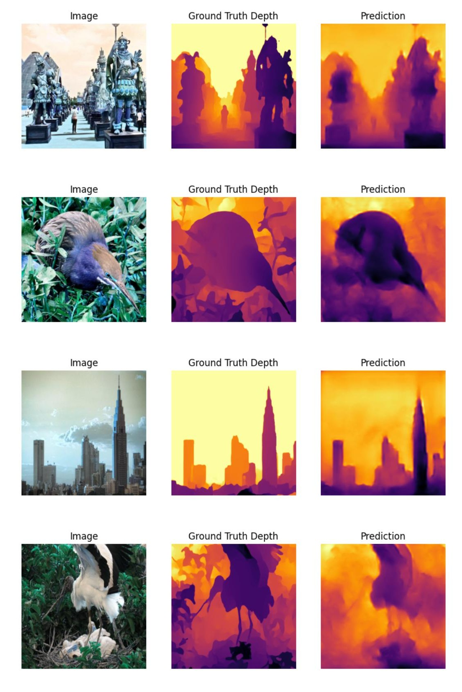
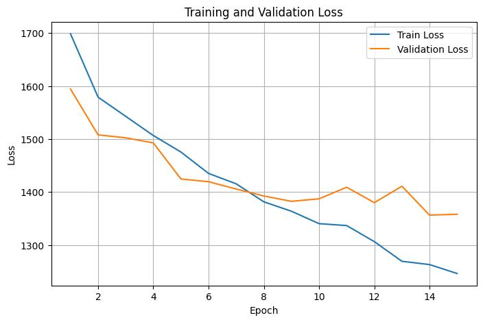

# Monocular Relative Depth Perception

This project contains an implementation of the relative depth perception model proposed in:

[Monocular Relative Depth Perception with Web Stereo Data Supervision](https://openaccess.thecvf.com/content_cvpr_2018/papers/Xian_Monocular_Relative_Depth_CVPR_2018_paper.pdf)

## Project Structure

You can find the implementation of the model architecture in the `depth_perception_model.py` file. The `DepthEstimationModel` class is the final class that is imported into the `train.ipynb` and used in the training section. You can also find the ranking loss of the paper in the `loss_function.py` file. For further details on the loss function and the model architecture, please refer to Section 3.2 of the paper.

We used [ReDWeb_V1](https://sites.google.com/site/redwebcvpr18/) dataset to train our model. To run train.ipynb, download the dataset and place it in the root directory of the project.

## Results

We trained the model for 15 epochs and obtained the following results:

**Note:** Due to limited computational resources (no access to a good GPU), the model was trained for only 15 epochs. Additionally, 1000 sample point pairs were used per image. (For more detailes about the sample points pairs, see Figure 5 of the paper)